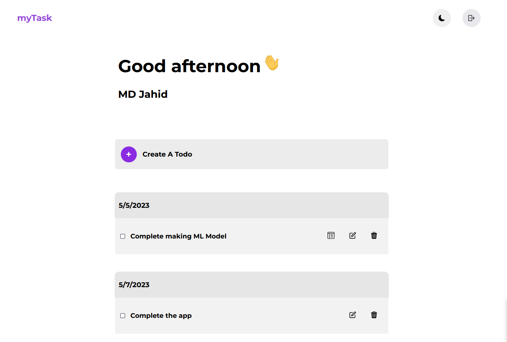
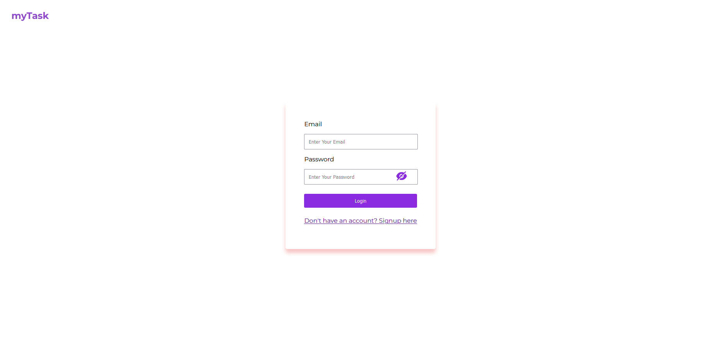
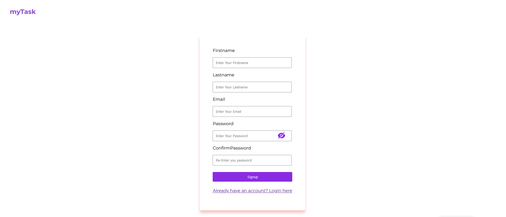

My Task is a Todo App with the ability to sort the todo with date

## Run locally
In order to run the application in your local environment,
At first use the following command:
```bash
git clone
```
or download the file and unzip it

### Set up backend
Open the terminal in the application folder and type the following:
```bash
cd ./backend
```
after that type
```bash
npm i
```
then make a .env file to store the MongoDB database by using following:
```bash
touch .env
```
#### setup the database
We have used MongoDB as our database
To install mongodb in local environment you can follow their official guideline [here](https://www.mongodb.com/docs/manual/installation/)

you need to create a MongoDB database in either local or cloud environment, 

you can do that by the following [https://www.mongodb.com/basics/create-database](https://www.mongodb.com/basics/create-database)

After making an mongoDB database you need to store the database Connection url 

in the .env file in the following format:
```bash
MONGODB_CONNECTION_URL = Enter your url here
```

After all the setup you can run your backend server with the following command:

```bash
npm start
```

Then you can see the backend up and running in [http://localhost:5000](http://localhost:5000)

### Set up the Frontend
Go to the frontend folder by following:

```bash
cd ../frontend
```

then run the following command to run the application
```bash
npm install
```
```bash
npm start
```
## ScreenShot






